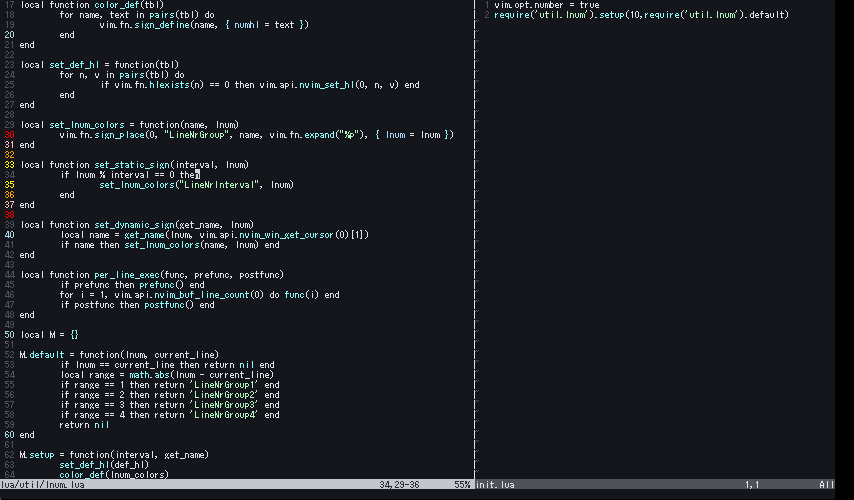

# lnum_color.lua



## usage

```lua
-- lazy.nvim
{
    'ozoramore/lnum_color.lua',
    opts = {
        10, -- interval,
        require('lnum_color').default, -- custom function
    }
}

-- others
require('lnum_color').setup(10, require('lnum_color').default)
```

or

```lua
local function lnumfunc(lnum, current_cursor_line)
    local range = math.abs(lnum - current_cursor_line)
    if range == 5 then return 'LineNrGroup1' end
    if range == 10 then return 'LineNrGroup2' end
    if range == 20 then return 'LineNrGroup2' end
    if range % 50 == 0 then return 'LineNrGroup3' end
    return nil
end

require('lnum_color').setup(5, lnumfunc)
```

or

```lua
require('lnum_color').setup(0, nil) -- do nothing.
```
